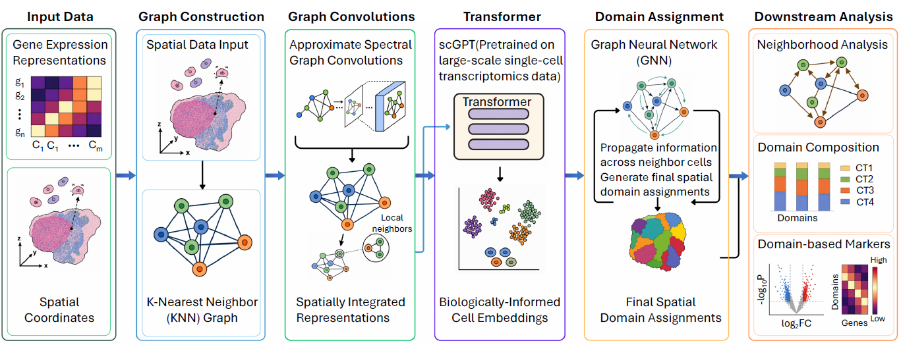

# stGPTNet: fine-tuning foundation models enables transferable domains in spatial transcriptomics

## Overview

**stGPTNet** is a supervised spatial representation learning framework that combines a pretrained transcriptomic foundation model (**scGPT**) with spatial graph learning for spatial domain identification and transfer in spatial transcriptomics.

## Repository Structure

| Directory | Description |
|---|---|
| [`stGPTNet/`](stGPTNet/) | Core implementation of stGPTNet |
| [`Supervised_domain_detection_methods/`](Supervised_domain_detection_methods/) | Supervised ML and GNN baseline methods |
| [`Unsupervised_domain_detection_methods/`](Unsupervised_domain_detection_methods/) | Unsupervised spatial domain detection methods |
| [`Ablation_analysis/`](Ablation_analysis/) | Ablation and sensitivity analyses |
| [`downstream_applications_NanoString_CosMx_NSCLC/`](downstream_applications_NanoString_CosMx_NSCLC/) | Downstream analysis of NanoString CosMx NSCLC data |
| [`stGPTNet_molecular_heterogeneity_breast_cancer/`](stGPTNet_molecular_heterogeneity_breast_cancer/) | Breast cancer molecular heterogeneity analysis |

## Datasets

The experiments use the following spatial transcriptomics datasets:

- **Maynard** — Human Visium data for spatial domain detection  
  https://figshare.com/articles/dataset/10x_visium_datasets/22548901

- **Xenium Breast Cancer** — Human breast cancer data

- **CosMx NSCLC** — NanoString CosMx lung cancer data

- **MOSTA** — Mouse organogenesis Stereo-seq data  
  https://db.cngb.org/stomics/mosta/download/

## Installation

Main requirements:

- Python ≥ 3.9
- PyTorch
- PyTorch Geometric
- scikit-learn
- NumPy
- Pandas
- scGPT

scGPT:  
https://github.com/bowang-lab/scGPT

Please refer to the individual directories for additional requirements and instructions.

## Experiments

The repository contains code for:

- Spatial domain identification
- Spatial niche/domain transfer
- Supervised and unsupervised benchmarking
- Ablation and sensitivity analysis
- Downstream cancer spatial transcriptomics applications

### 📌 Notes

- All methods are evaluated under the same experimental settings for fair comparison  
- Evaluation metrics include:
  - **ARI, NMI**
  - **F1-score, Accuracy, Precision, Recall**  
- The code reproduces results corresponding to Sections **2.2 → 2.8**  
